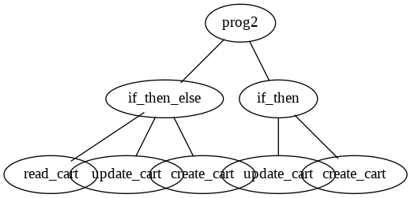

# DRL4REST

In Deep Reinforcement Learning for REST (DRL4REST) we aim for a sim-to-real approach learning REST interfaces to achieve interoperability. Latter is conceived as a rational goal-driven behavior of the service.

It works in two steps

1. Train a deep reinforcement learning (DRL) algorithm on a simulated service behavior
1. Fine-tune the DRL on the real application service to achieve interoperability

The simulated service behavior is one of many possible behaviors of the real application service. This research investigates how we can improve learning the real service when probing the space of simulated service behaviors.

Generally, we do not know the service behavior behind a REST interface, if there is only the interface specification available. As a consequence, we plug-in a simulation created by Genetic Programming (GP), which essentially results in a piece of code generating valid responses to concrete requests. In contrast to mocking approaches, GP enables more complex behaviors. 

The following workflow illustrates the DRL4REST approach starting with an interface specification as input.


## Preps

Create a `.env` file in the project's root specifying global environment variables.
```
# In the container, this is the directory where the code is found
APP_ROOT=/DRL4REST

# the HOST directory containing directories to be mounted into containers
# e.g. /home/username/DRL4REST
VOL_DIR=<project root>
```

## Quickstart

Start in project's root dir. Create docker image
```bash
docker-compose build apigenerator 
```

Start in project's root dir. Generate API code:  
```bash
cd scripts
openapi-generator.sh
```
It generates python (client) and python-flask (server) code and places in the `openapi` directory. The default API is [CartPole-v0 version 1.0](src/cartpole/spec/OpenAPIv1.json). 

Change the behavior with:
```
Usage : ./openapi-generator.sh [-h] [-a] [-n]

-a API_SPEC_URL
-n API_NAME 
```

Start the python client and server. Create docker image
and spin up the `pyclient` and `pyserver` container  
```bash
docker-compose up -d pyclient pyserver
```

Setup and start the server 
```bash
docker exec -it pyserver /bin/bash

cd /DRL4REST/scripts
./pyserver_setup.sh
```
Check the server is running pointing your browser to http://localhost:8000/ui/

In an other terminal setup the client
```bash
docker exec -it pyclient /bin/bash

cd /DRL4REST/scripts
./pyclient_setup.sh
```
Confirm that you can successfully download the API spec from the `pyserver` container from within the `pyclient` container.
```bash
 wget http://pyserver:8080/openapi.json
 ```

## Genetic Programming

Generally, we do not know the service behavior behind a REST interface, if there is only the interface specification available. As a consequence, we plug-in a simulation, which is essentially a piece of code generating valid responses to concrete requests. 

Genetic Programming (GP) creates the program behind the REST interface. When a client sends a request to the REST interface, the created program generates a reply sent back to the client. For GP we use the python [DEAP](https://github.com/deap/deap) framework. It is installed in a jupyter-scipy docker image.

Spin up the jupyscipy container
```bash
docker-compose up -d jupyscipy
```

Point your browser to http://localhost:8008 and test an example GP by loading and running the [`gp_test.ipynb`](notebooks/gp_test.ipynb). It will find a regression function from data. A [tree graph](notebooks/graph.png) represents the regression function found by GP.

The notebook [`gp_cartpole_server.ipynb`](notebooks/gp_cartpole_server.ipynb) shows the GP approach applied to the [cartpole](https://en.wikipedia.org/wiki/Inverted_pendulum) example. 

The following tree graph displays the program found by GP for an idempotent REST behavior when calling `GET /api/v1/cart`.



## Development IDE

Add a `.gitconfig` file  in the project's root with the following content.

```
[user]
	name = <git user name>
	email = <mail address>
[credential]
	helper = cache
```

Spin up vscode container

```bash
docker-compose up -d vscode
```

Point your browser to it: https://127.0.0.1:8080

The vscode docker image comes pre-installed with following extentions especially for working with shell scripts.

* [shfmt](https://github.com/mvdan/sh)
* [shellchecker](https://github.com/koalaman/shellcheck)

The shellchecker runs on-the-fly and provides quick fixes for better coding quality of shell scripts. The shfmt tool reformats the shell script. Use `shift + alt + f` to reformat the script.
